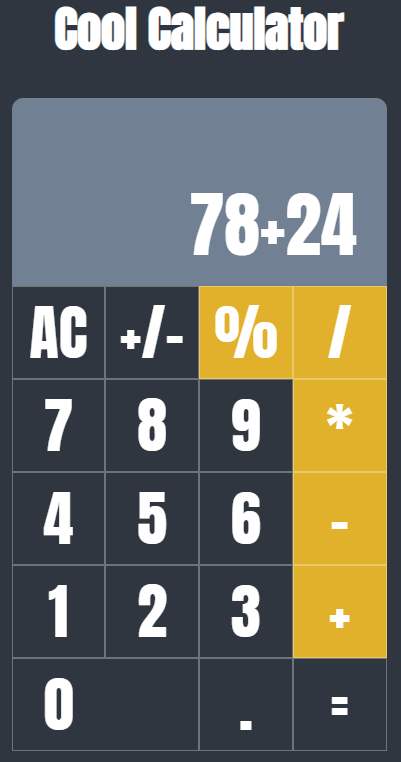

# Cool Calculator

## Skils

1. HTML
2. CSS
3. Javascript

## Using API

1. none

## Function

1. output : 계산기 출력
2. clear : 계산기 초기화
3. numbers : 숫자 입력 받고 출력
4. operate : 연산자 입력 받고 출력
5. calculate : 계산

## Problems

1. 계산기에는 입력할 수 있는 개수 제한이 있다. 계산 결과물을 문자열로 바꾼 후에 길이가 10을 넘어가게 되면 Error 뜨게 했다.

2. 숫자 연산에는 우선순위가 있어 덧셈, 뺄셈보다 곱셈, 나누기, 나머지 연산을 먼저 해줘야 하는데 이 문제를 해결하기 위해 곱셈, 나누기, 나머지 연산을 먼저 forEach로 처리하고 그 다음에 덧셈과 뺄셈 연산을 for 문으로 처리했다.

## Result

