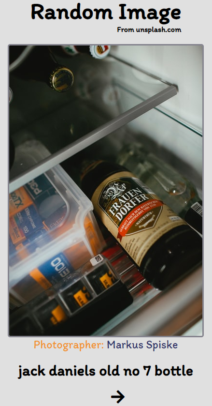

# RandomImageTool

## Skils

1. HTML
2. CSS
3. Javascript

## Using API

1. [Unsplash](https://source.unsplash.com/)

## Function

1. 랜덤 이미지 정보 output
2. Arrow 버튼을 이용한 이미지 릴레이

## Problems

1. Unsplash API 키가 DEMO라서 시간당 송출할 수 있는 사진제한이 50장이다. 해결법은 unsplash 측에서 your app을 승인해주면 시간당 사진 제한이 5000장인 products 등급으로 업그레이드된다.

## Result

