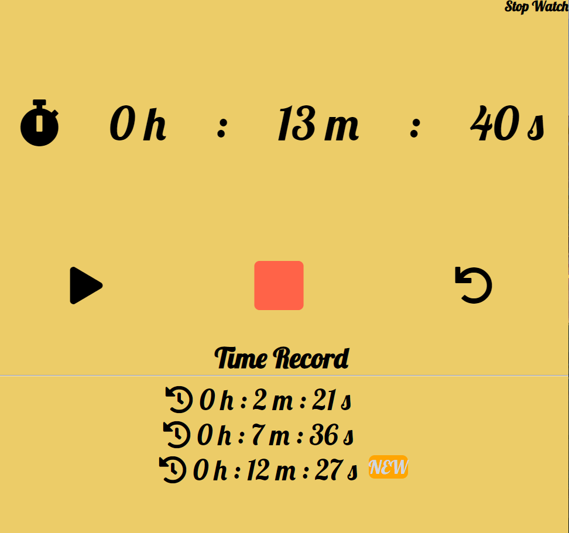

# stopWatch

## Skils

1. HTML
2. CSS
3. Javascript

## Using API

1. none

## Function

1. timeStart : 재생버튼 클릭시 타이머 시작
2. timePause : 일시중지 버튼 클릭시 타이머 일시중지
3. timeStop : 중지 버튼 클릭시 타이머 초기화
4. timeSave : 저장 버튼 클릭시 시간 기록
5. init : 시간 출력

## Problems

1. none

## Result

