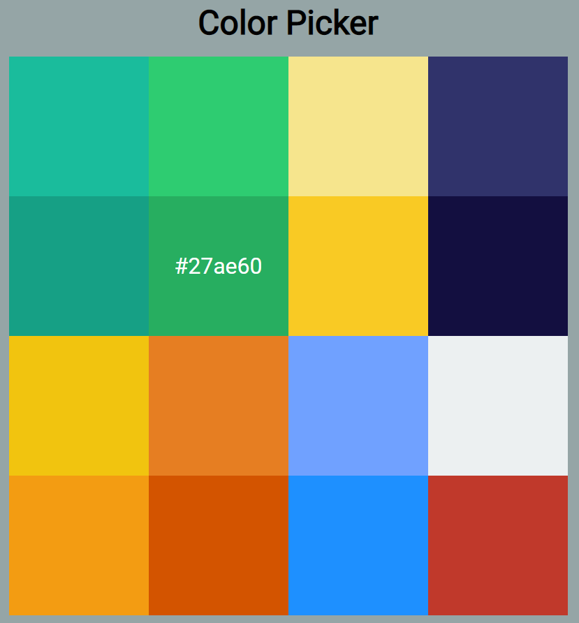
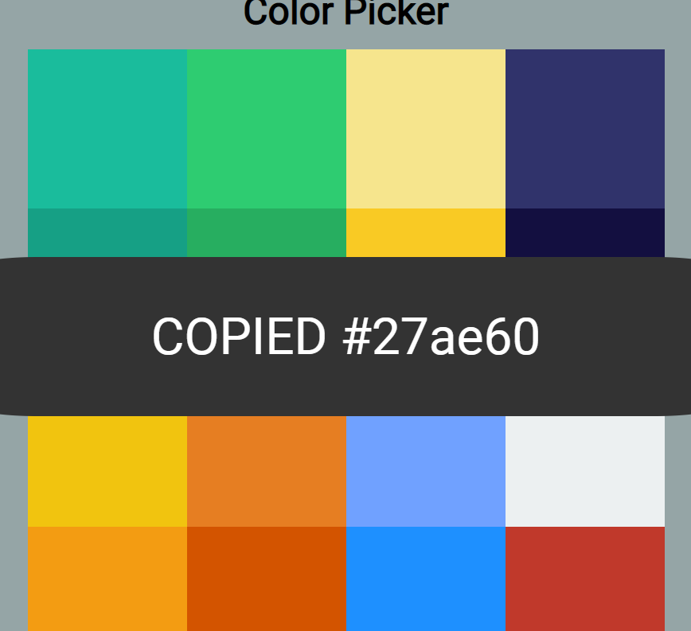

# colorPicker

## Skils

1. HTML
2. CSS
3. Javascript

## Using API

1. none

## Function

1. painting : 컬러박스를 색칠하고 text 출력
2. clipboard : 컬러박스를 누를시에 해당 컬러가 hexadecimal number로 복사되는 기능

## Problems

1. 처음 코딩할 때 컬러박스들의 값들을 가져올 때 TagName으로 가져왔었다. 이 값을 변수에 넣어 foreach 문을 사용하려고 했으나 오류가 발생했었다. MDN 문서를 살펴보니 getElementsByTagName는 HTMLCollection을 반환하고 이 값은 배열과 유사한 객체였다. 해결방법은 querySelectorAll로 대체하였다.

## Result

